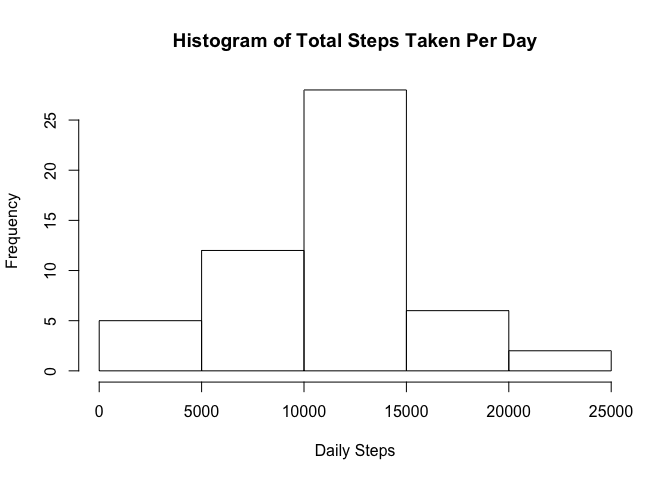
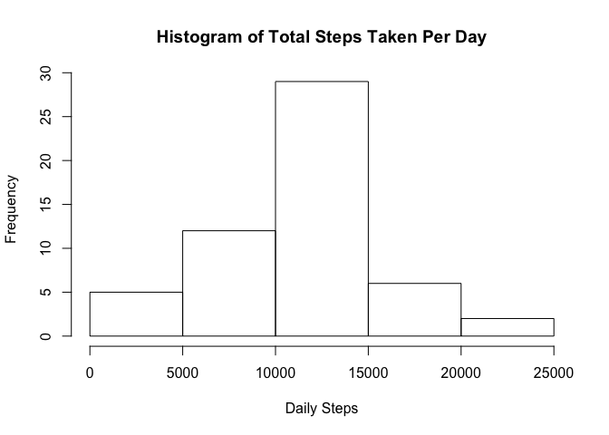
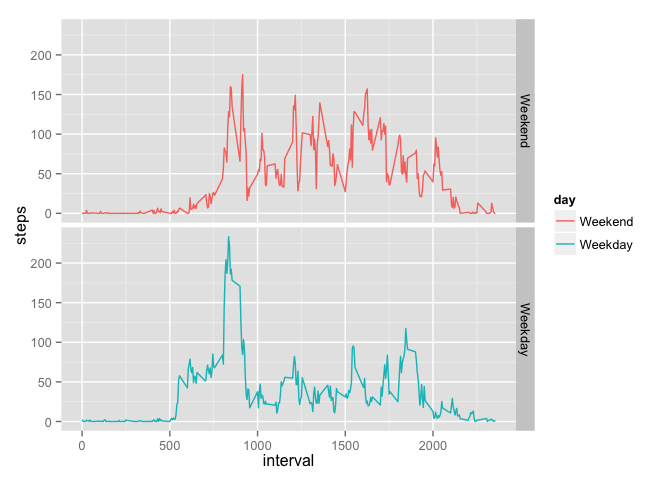

# Reproducible Research: Peer Assessment 1


## Loading and preprocessing the data

Unzip and load the data. Packages loaded are ggplot2 and dplyr.


```r
## Unzip and load the data
unzip("activity.zip")
data <- read.csv("activity.csv")
```


```r
## load packages without messy output
library(ggplot2)
library(dplyr)
```

## What is mean total number of steps taken per day?


```r
## Calcluate the daily sum of steps
sum_data <- aggregate(steps ~ date, data, sum)
hist(sum_data$steps, xlab = "Daily Steps", main = "Histogram of Total Steps Taken Per Day")
```

 


```r
mean_daily_sum <- mean(sum_data$steps, na.rm = TRUE)
mean_daily_sum
```

```
## [1] 10766.19
```


```r
median_daily_sum <- median(sum_data$steps, na.rm = TRUE)
median_daily_sum
```

```
## [1] 10765
```

## What is the average daily activity pattern?

The average daily steps taken for a partucular time interval. In other words, at the same time interval per day what is the average steps taken?


```r
interval_average <- aggregate(steps ~ interval, data, mean, na.rm = TRUE)
plot <- ggplot(interval_average, aes(interval, steps)) + 
                geom_line(color="blue") +
                theme_bw() + 
                labs(x = "Time Interval (5 min increments)", y = expression("Average Steps per day")) + 
                labs(title = expression("Average Daily Pattern (5 min interval time series)"))
print(plot)
```

 

Which 5-minute interval, on average across all the days in the dataset, contains the maximum number of steps?


```r
interval_average[which.max(interval_average$steps),]
```

```
##     interval    steps
## 104      835 206.1698
```

Interval 835 contains the highest average steps (206.1698)

## Imputing missing values

How many missing values are there?


```r
sum(is.na(data$steps))
```

```
## [1] 2304
```

Fill in missing values with the avearge 5 min value from the corresponding interval. i.e if interval data at row 10 is missing for a partucular day, replace it with the caluclated value for interval row 10 across all available data. This allows me to create a new dataset that is equal to the original dataset but with the missing data filled in. 


```r
missing_data <- interval_average[is.na(data$steps),]

## take a copy of the data set
filled_data <- data
## replace the NA entries with the calculated average for that interval
for (i in which(is.na(data$steps))) {
        filled_data[i,1] <- interval_average[i,2]
}
```

Make a histogram of the total number of steps taken each day and Calculate and report the mean and median total number of steps taken per day. 

```r
sum_data_filled <- aggregate(steps ~ date, filled_data, sum)
hist(sum_data_filled$steps, xlab = "Daily Steps", main = "Histogram of Total Steps Taken Per Day")
```

 

```r
mean_daily_sum_filled <- mean(sum_data_filled$steps)
median_daily_sum_filled <- median(sum_data_filled$steps)
```

Do these values differ from the estimates from the first part of the assignment? What is the impact of imputing missing data on the estimates of the total daily number of steps?


```r
print(paste0("There is a ",round(((mean_daily_sum - mean_daily_sum_filled)/mean_daily_sum)*100, 2),"% difference in the mean with the filled data"))
```

```
## [1] "There is a 0% difference in the mean with the filled data"
```

```r
print(paste0("There is a ",round(((median_daily_sum - median_daily_sum_filled)/median_daily_sum)*100, 2),"% difference in the median with the filled data"))
```

```
## [1] "There is a -0.01% difference in the median with the filled data"
```

The data is not majorly effected but the replacing scheme.

## Are there differences in activity patterns between weekdays and weekends?

Need to split the days out to Weekend or Weekdays.


```r
filled_data$date <- strptime(filled_data$date, "%Y-%m-%d")
filled_data <- mutate(filled_data, day = weekdays(date))
my_weekend <- c("Saturday", "Sunday")
filled_data$day <- factor(filled_data$day %in% my_weekend, 
                        levels=c(TRUE, FALSE), labels=c('Weekend', 'Weekday'))
head(filled_data)
```

```
##       steps       date interval     day
## 1 1.7169811 2012-10-01        0 Weekday
## 2 0.3396226 2012-10-01        5 Weekday
## 3 0.1320755 2012-10-01       10 Weekday
## 4 0.1509434 2012-10-01       15 Weekday
## 5 0.0754717 2012-10-01       20 Weekday
## 6 2.0943396 2012-10-01       25 Weekday
```

```r
## Awesome got a factor we can facet on!
```

Ok now we have the data tagged properly we can calculate the average (mean) and plot on the Weekday/end factor 


```r
interval_average_by_day <- aggregate(steps ~ interval + day, filled_data, mean)
plot <- ggplot(interval_average_by_day, aes(interval, steps, color = day)) + 
                geom_line() +
                facet_grid(day ~ .)
                theme_bw()
print(plot)
```

 

So there appears to be more consistent movement through the weekend versus weekdays.
